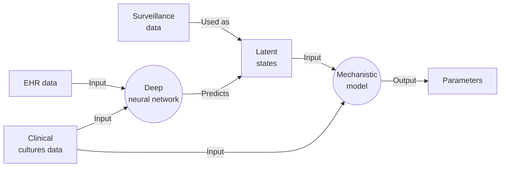
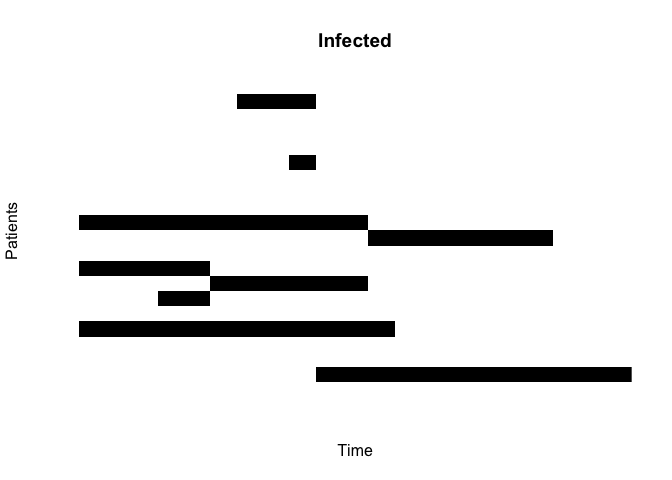

# Simulating HAIs
George G. Vega Yon, Ph.D.
2025-04-03

## Idea of a model

1.  We train a deep neural network (DNN) to predict the latent state of
    a patient. We can do this using EHR data and clinical cultures as
    input. The model will predict the latent state (surveillance data).

2.  Then, instead of using the existing Bayesian transmission model (in
    which we simulate the latent states as augmented data,) we use the
    latent state predicted by the DNN as input to the mechanistic model.

3.  The Bayesian model will still use the clinical cultures as input,
    but the latent state will be predicted by the DNN, not simulated on
    the fly.

4.  The mechanistic model can still be used directly to do inferences
    about the transmission and importation parameters.



## Mathematical description of the model

Let $s_{ij}$ be the result of a test given to patient $i$ in time $j$,
$\{\xi_p, \xi_n\}$ be the false positive and negative rates,
respectively, and $a_i$ be the latent state of the patient $i$, equal to
one if the patient is positive.

``` math
\mbox{log}P(D|A) \approx \sum_{i: a_i = 1} \text{log}\left[\xi_p^{s_{ij}}(1 - \xi_p)^{1 - s_{ij}}\right] + \sum_{i: a_i = 0} \text{log}\left[\xi_n^{s_{ij}}(1 - \xi_n)^{1 - s_{ij}}\right]
```

The dataset $A$ (augmented data), is simulated using the first
observation as a starting point. During the model fitting process, we
sample 100 times the latent state of the patients, and we keep the one
that gives the maximum likelihood. A better approach is to use a Gibbs
sampler (which is what the original paper does), but this is not
implemented in this code.

## Simulation example

The simulation example is a simple SIR model, where the patients are
infected with a disease. The disease is transmitted with a rate $c$, and
the recovery rate is $r$. The testing rate is $t$.

``` r
set.seed(3576)
# Number of patients
n <- 20
p_disease <- .3 
```

``` r
n_times <- 21
infected <- matrix(0L, nrow = n, ncol = n_times)
infected[, 1] <- as.integer(runif(n) < p_disease)

R0         <- 1.1
t_rate_pop <- 0.2
r_rate     <- 1/7
c_rate_pop <- R0 * r_rate / t_rate_pop

# Testing surveillance
false_positive <- 0.05
false_negative <- 0.05
test_results <- matrix(NA_integer_, nrow = n, ncol = n_times)
prop_tested <- 0.5

sim_fun <- function(
  c_rate, t_rate, 
  false_positive, false_negative,
  prop_tested,
  verbose = FALSE
  ) {

  infected[, 2:n_times] <- 0L

  for (i in 2:n_times) {
  
    # Which are infected
    is_infected <- which(infected[, i - 1] == 1)
    is_not_infected <- which(infected[, i - 1] == 0) |>
      # Remove those who were infected before
      # (i.e. those who are infected in the previous times)
      setdiff(which(rowSums(infected[,1:i]) > 0))
  
    # Checking recovery of infected
    recovers <- runif(length(is_infected)) < r_rate
    infected[is_infected[which(recovers)], i] <- 0
    infected[is_infected[which(!recovers)], i] <- 1
  
    # Who will become infected
    n_no_infected <- length(is_not_infected)
    n_contacts <- rbinom(
      n_no_infected, size = length(is_infected),
      prob = c_rate/n
      )
  
    # Probability of becoming infected
    new_infected <- which(runif(n_no_infected) < (1 - (1 - t_rate)^n_contacts))
    infected[is_not_infected[new_infected], i] <- 1

    # Checking testing
    n_tested <- rbinom(1, size = n, prob = prop_tested)
    tested <- sample(1:n, size = n_tested)
    test_results[tested, i] <- as.integer(
      runif(n_tested) < (1 - false_positive) * infected[tested, i] +
      (1 - false_negative) * (1 - infected[tested, i])
    )
  
    if (verbose && interactive()) {
      message(sprintf(
          "Time: % 4i | Infected: % 4i | Recovered: % 4i | New infected: % 4i",
          i, sum(infected[, i]), length(recovers), length(new_infected)
      ))
    }
  

  }

  list(
    infected = infected,
    test_results = test_results
  )
}

set.seed(3312)
dat <- sim_fun(
  c_rate = c_rate_pop,
  t_rate = t_rate_pop,
  false_positive = false_positive,
  false_negative = false_negative,
  prop_tested = prop_tested
)

# Checking values
(true_positives <- mean(dat$test_results[dat$infected == 1], na.rm = TRUE))
```

    [1] 0.9666667

``` r
(true_negatives <- mean(dat$test_results[dat$infected == 0], na.rm = TRUE))
```

    [1] 0.9695122

Here is what the sampled data looks like:

``` r
image(
  t(dat$infected), xlab = "Time", ylab = "Patients", axes = FALSE,
  main = "Infected", col = c("white", "black")
)
```



## Estimation of the parameters

The estimation of the parameters is done using maximum a posteriori
(MAP) estimation. We use the limited memory bounded BFGS (L-BFGS-B)
algorithm to optimize the log-likelihood function. The log-likelihood
function is computed using the simulated data and the parameters of the
model.

To compute the $\mbox{log}P(D|A)$, we use the following procedure:

1.  Simulate the data 100 times using the parameters of the model.
2.  For each simulation, compute the log-likelihood of the data given
    the parameters.
3.  Keep the simulation that gives the maximum likelihood.
4.  Return the posterior probability of the parameters given the data.

We use a prior for the transmission rate, which is a beta distribution
with parameters $(4, 18)$. We also use a narrow prior for the false
positive and negative rates, which is a beta distribution with
parameters $(2, 18)$.

Here is the implementation:

``` r
#' @param theta Parameters of the model
#' @param dat Data to be used (test results)
map_params <- function(theta) {
  # Transforming the parameters
  crate <- exp(theta[1])
  t_rate <- plogis(theta[2])
  false_positive <- plogis(theta[3])
  false_negative <- plogis(theta[4])
  
  c(crate, t_rate, false_positive, false_negative)
}

loglik <- function(theta, dat) {

  # Theta is taken in the real line, so we transform it
  # back to the original scale

  # Parameters
  theta <- map_params(theta)
  crate <- theta[1]
  t_rate <- theta[2]
  false_positive <- theta[3]
  false_negative <- theta[4]

  # Simulating the data 100 times (to get the best)
  # In the original paper, they use a Gibbs sampler to update
  # the histories
  dat_sim <- parallel::mclapply(1:100, \(i) {
    sim_fun(
      c_rate = crate,
      t_rate = t_rate,
      false_positive = false_positive,
      false_negative = false_negative,
      prop_tested = prop_tested
    )$infected
  }, mc.cores = 10
  )

  # Who was tested in the original data
  tested <- which(!is.na(dat), arr.ind = TRUE)
  test_result <- dat[tested]

  # Computing the likelihood
  ans <- sapply(dat_sim, \(d) {
    # Getting the test results
    latent_state <- d[tested]
    
    dbinom(
      test_result, 
      size = 1, 
      prob = (1 - false_positive) * latent_state +
        (1 - false_negative) * (1 - latent_state),
      log = TRUE
    ) |> sum()
  }) 
  
  # Stay with the history that gives the maximum likelihood
  ans <- max(ans)

  # Prior about test results
  ans +
  sum(dbeta(
    c(false_positive, false_negative),
    shape1 = 2,
    shape2 = 18,
    log = TRUE
  )) +
#   dnorm((crate - c_rate_pop), log = TRUE) +
  dbeta(t_rate, shape1 = 4, shape2 = 18, log = TRUE) 

}
```

Here is the optimization process

``` r
set.seed(3312)
ans <- optim(
  par = rep(0, 4), fn = loglik, dat = dat$test_results,
  method = "L-BFGS-B",
  lower = -10, upper = 10, 
  control = list(fnscale=-1, factr = 200)
  )

ans
```

    $par
    [1]  0.08028953 -1.20631209 -3.92108065 -6.67665030

    $value
    [1] -28.12947

    $counts
    function gradient 
          36       36 

    $convergence
    [1] 0

    $message
    [1] "CONVERGENCE: REL_REDUCTION_OF_F <= FACTR*EPSMCH"

Comparing with the population parameters:

``` r
cbind(
  Estimated = map_params(ans$par),
  True = c(
    crate = c_rate_pop,
    t_rate = t_rate_pop,
    false_positive = false_positive,
    false_negative = false_negative
  )
) |> knitr::kable(digits = 4)
```

|                | Estimated |   True |
|:---------------|----------:|-------:|
| crate          |    1.0836 | 0.7857 |
| t_rate         |    0.2304 | 0.2000 |
| false_positive |    0.0194 | 0.0500 |
| false_negative |    0.0013 | 0.0500 |
